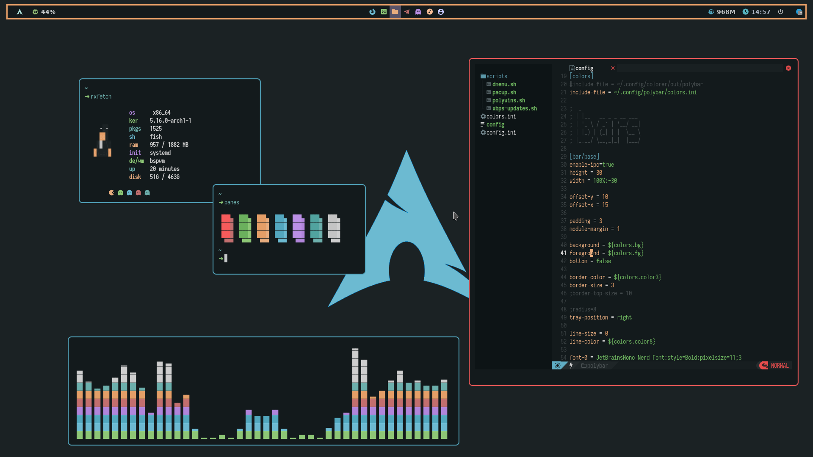

<p align="center">
  
</p>

<p align="center">
  <b> UwU BSPWM Rice </b>
</p>

<p align="center">
 
</p>

# Screenshot


- **OS:** Arcolinux
- **Colorscheme:** [UwU](https://github.com/mangeshrex/uwu.vim)
- **Text Editor:** NeoVim with [NvChad](https://github.com/NvChad/NvChad)
- **WM:** Don't you see it up there?

# Notes

- Fonts i use : Iosevka nerd font, JetBrainsMono, Hack, Source Code Pro, etc
- Terminal i use : alacritty
- I personally use 7 workspaces, you can change amount of workspace as you like
- You need to copy all the folder inside the dots repo to your ~/.config, then do ```chmod +x ~/.config/bspwm/*``` to make bspwm loads the configuration

# Credits

- [Mangeshrex](https://github.com/Mangeshrex) for the Colorscheme
- [Kiddae](https://github.com/kiddae) for the polybar stuffs
- Anyone who helped me!
